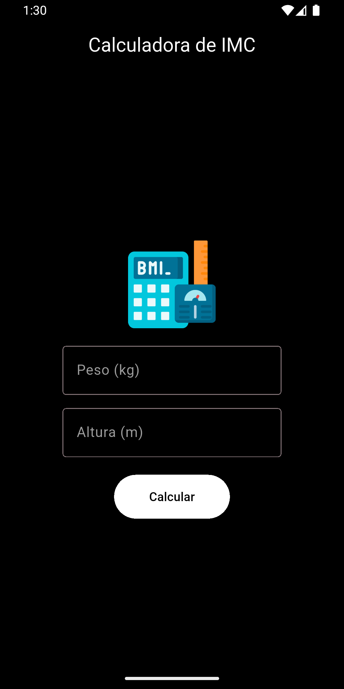
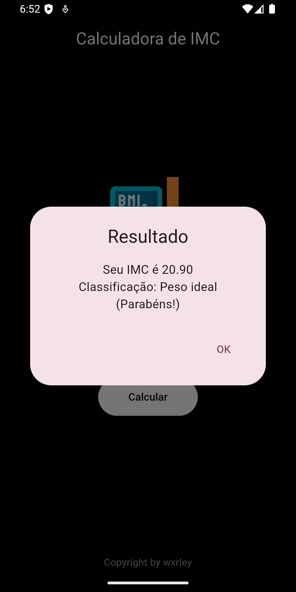
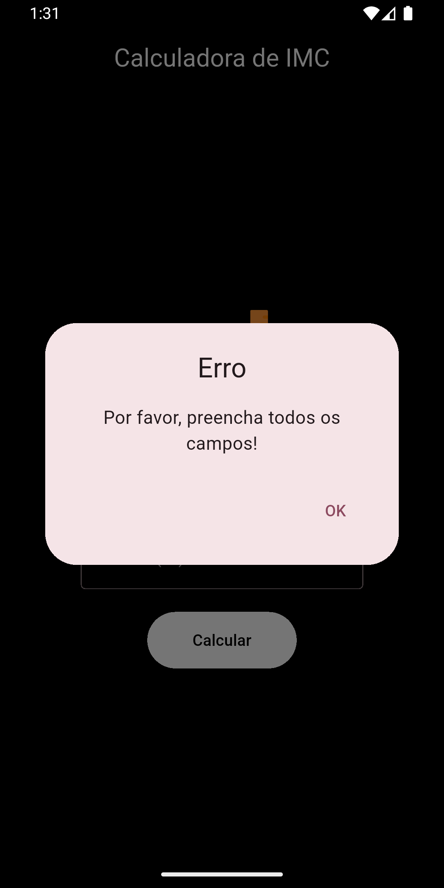
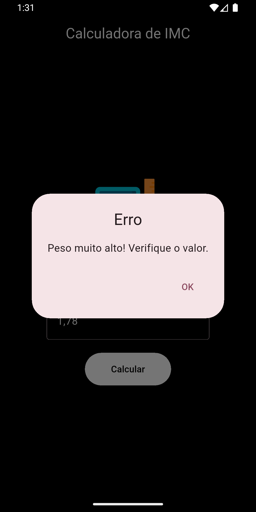

# 📱 BMI Calculator 🏋️
Aplicativo **Flutter** para cálculo de Índice de Massa Corporal.

## 💡 Sobre o projeto
O **BMI Calculator** é uma calculadora de IMC com interface clean, validação de dados e feedback visual imediato através de dialogs.

## ⚙️ Funcionalidades
- **Cálculo Preciso:** Calcula o IMC com base em peso (kg) e altura (m).
- **Validação Inteligente:** Aceita apenas números com até 2 casas decimais (suporta vírgula e ponto).
- **Classificação Automática:** Categoriza o resultado em Abaixo do peso, Peso ideal, Levemente acima do peso, Obesidade grau I, II ou III.
- **Interface Dark:** Design minimalista com tema preto e branco.
- **Feedback Imediato:** Mensagens de erro claras para entradas inválidas.
- **Prevenção de Erros:** Bloqueia valores absurdos (altura > 3m, peso > 500kg).

## 🧩 Tecnologias Utilizadas
- Flutter
- Dart
- Material Design 3

## 📁 Estrutura do Projeto
```
bmi_calculator/
├── lib/
│   ├── bmi_calculator.dart
│   ├── calculator_screen.dart
│   └── main.dart
├── assets/
│   └── images/
│       └── bmi.png
└── pubspec.yaml
```

## 🛠️ Instalação
**1.** Verifique se o **Flutter** está instalado na sua máquina:
> Para confirmar, execute no terminal:
> ```bash
> flutter --version
> ```
> Caso precise, baixe o [Flutter](https://docs.flutter.dev/get-started/install).

**2.** Baixe ou clone este repositório para o seu computador:
> ```bash
> git clone https://github.com/wxrley/bmi_calculator.git
> ```

**3.** Entre na pasta do projeto e instale as dependências:
> ```bash
> cd bmi_calculator
> flutter pub get
> ```

## 🚀 Execução
#### Opção 1 — Via Terminal
**1.** Entre na pasta raiz do projeto, conecte um dispositivo ou inicie o emulador e execute:
> ```bash
> flutter run
> ```
**2.** O app será compilado e instalado automaticamente no dispositivo conectado.

#### Opção 2 — Via IDE (VS Code, Android Studio, IntelliJ)
**1.** Abra a pasta do projeto na sua IDE preferida. \
**2.** Conecte um dispositivo ou inicie um emulador. \
**3.** Abra o arquivo `main.dart` e clique em **Run**.

## 🧪 Como Testar
**1.** Abra o aplicativo no dispositivo/emulador. \
**2.** Insira os valores de **peso** e **altura**. \
**3.** Clique no botão **"Calcular"**. \
**4.** Um dialog será exibido com o resultado.

> [!NOTE]
> O app utiliza regex para bloquear entrada de letras e limitar casas decimais automaticamente, garantindo uma experiência livre de erros.

## 🖼️ Screenshots
<table>
  <div align="center">
  <tr>
    <td></td>
    <td></td>
  </tr>
  <tr>
    <td align="center"><b>🧮 Tela de cálculo</b></td>
    <td align="center"><b>📝 Tela do resultado</b></td>
  </tr>
  <tr>
    <td></td>
    <td></td>
  </tr>
  <tr>
    <td align="center"><b>❌ Tela de erro</b></td>
    <td align="center"><b>❌ Tela de erro</b></td>
  </tr>
  </div>
</table>

## 👨‍💻 Autor
**Wxrley** — só mais um dev latino americano 💪
